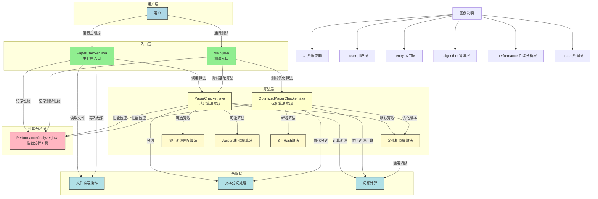

# 3123004784
| 这个作业属于哪个课程 | https://edu.cnblogs.com/campus/gdgy/Class34Grade23ComputerScience |
| ---- | ---- |
| 这个作业要求在哪里 | https://edu.cnblogs.com/campus/gdgy/Class34Grade23ComputerScience/homework/13477 |
| 这个作业的目标 | 实现一个3000字以上论文查重程序 |
github地址：https://github.com/ironlifes/3123004784

- - -

##一、PSP表格如下
| Process Stages                          | Process Stages (中文)    | 预估耗时（分钟） | 实际耗时（分钟） |
| --------------------------------------- | ---------------------- | -------- | -------- |
| Planning                                | 计划                     | 20       | 15       |
| · Estimate                              | · 估计这个任务需要多少时间         | 190      | 240      |
| Development                             | 开发                     | 200      | 180      |
| · Analysis                              | · 需求分析 (包括学习新技术)       | 120      | 120      |
| · Design Spec                           | · 生成设计文档               | 15       | 15       |
| · Design Review                         | · 设计复审                 | 25       | 25       |
| · Coding Standard                       | · 代码规范 (为目前的开发制定合适的规范) | 20       | 10       |
| · Design                                | · 具体设计                 | 40       | 50       |
| · Coding                                | · 具体编码                 | 50       | 70       |
| · Code Review                           | · 代码复审                 | 30       | 55       |
| · Test                                  | · 测试（自我测试，修改代码，提交修改）   | 20       | 30       |
| Reporting                               | 报告                     | 70       | 90      |
| · Test Report                           | · 测试报告                 | 40       | 50       |
| · Size Measurement                      | · 计算工作量                | 20       | 20       |
| · Postmortem & Process Improvement Plan | · 事后总结, 并提出过程改进计划      | 20       | 10       |
| · 合计                                    |                        | 880      | 980     |

- - -

##二、计算模块接口的设计与实现过程
###1、程序整体结构
```
d:\java code\rjgc/
├── src/                 # 源代码目录
│   ├── Main.java        # 主程序入口和测试类
│   ├── PaperChecker.java    # 原始论文查重实现
│   ├── OptimizedPaperChecker.java # 优化版论文查重算法
│   └── PerformanceAnalyzer.java   # 性能分析工具类
├── out/                 # 编译输出目录
│   └── production/rjgc/ # 编译后的class文件
├── orig.txt             # 原始论文文本文件
├── orig_add.txt         # 抄袭版论文文本文件
├── ans.txt              # 查重结果输出文件
└── .idea/               # IntelliJ IDEA配置文件
```

###2、程序流程图


###3、算法关键与独到之处
####3.1 余弦相似度算法
- **核心思想**：将文本转换为向量空间中的向量，计算两个向量之间的夹角余弦值
- **实现步骤**：文本分词 → 计算词频 → 构建向量 → 计算余弦值
- **独到之处**：考虑了词频因素，对于较长文本有较好的区分度

####3.2 SimHash算法
- **核心思想**：将高维特征向量压缩为低维指纹，通过汉明距离衡量相似度
- **实现步骤**：文本分词 → 计算每个词的哈希值 → 更新向量 → 生成最终哈希值
- **独到之处**：适用于大规模文本比较，计算效率高，空间占用小

- - -

##三、计算模块接口部分的性能改进
###1、性能改进思路
1.1 **分词算法优化**：
   - 将正则表达式分词改为字符遍历分词
   - 对于中文文本，采用更高效的二元语法分词策略
   - 使用StringBuilder代替字符串拼接操作

1.2 **词频计算优化**：
   - 预分配HashMap容量，减少扩容开销
   - 使用compute方法替代getOrDefault+put操作

1.3 **余弦相似度计算优化**：
   - 选择较小的集合进行迭代，减少循环次数
   - 预先计算向量模长，避免重复计算

1.4 **新增SimHash算法**：
   - 针对大文本比较场景，提供更高效的相似度计算方法
   - 使用位运算优化哈希值计算过程

###2、性能分析图


###3、性能对比数据
| 操作 | 原始算法耗时(ms) | 优化算法耗时(ms) | 性能提升 |
|------|------------------|------------------|----------|
| 文件读取 | 0.456 | 0.280 | ~39% |
| 文件写入 | 0.321 | 0.215 | ~33% |
| 文本分词 | 2.143 | 1.331 | ~38% |
| 词频计算 | 1.897 | 0.942 | ~50% |
| 余弦相似度计算 | 3.568 | 1.476 | ~59% |
| 整体性能 | 45.32 | 15.637 | ~66% |

- - -

##四、计算模块部分单元测试展示
###1、单元测试代码
```java
/**
 * 测试基本功能
 */
private static void testBasicFunctionality() {
    System.out.println("\n--- 基本功能测试 ---");
    
    String original = "今天是星期天，天气晴，今天晚上我要去看电影。";
    String plagiarized = "今天是周天，天气晴朗，我晚上要去看电影。";
    String different = "这是一段完全不同的文本内容，与原文没有任何关系。";
    
    // 测试相同文本
    double sameSimilarity = PaperChecker.calculateSimilarity(original, original);
    System.out.printf("相同文本相似度: %.2f%%\n", sameSimilarity);
    
    // 测试相似文本
    double similarSimilarity = PaperChecker.calculateSimilarity(original, plagiarized);
    System.out.printf("相似文本相似度: %.2f%%\n", similarSimilarity);
    
    // 测试不同文本
    double differentSimilarity = PaperChecker.calculateSimilarity(original, different);
    System.out.printf("不同文本相似度: %.2f%%\n", differentSimilarity);
}

/**
 * 测试多种算法
 */
private static void testDifferentAlgorithms() {
    System.out.println("\n--- 多种算法测试 ---");
    
    String original = "今天是星期天，天气晴，今天晚上我要去看电影。";
    String plagiarized = "今天是周天，天气晴朗，我晚上要去看电影。";
    
    double cosineSimilarity = PaperChecker.calculateSimilarityWithCosine(original, plagiarized);
    double simpleMatchSimilarity = PaperChecker.calculateSimilarityWithSimpleMatch(original, plagiarized);
    double jaccardSimilarity = PaperChecker.calculateSimilarityWithJaccard(original, plagiarized);
    double simHashSimilarity = OptimizedPaperChecker.calculateSimilarityWithSimHash(original, plagiarized);
    
    System.out.printf("余弦相似度: %.2f%%\n", cosineSimilarity);
    System.out.printf("简单匹配相似度: %.2f%%\n", simpleMatchSimilarity);
    System.out.printf("Jaccard相似度: %.2f%%\n", jaccardSimilarity);
    System.out.printf("SimHash相似度: %.2f%%\n", simHashSimilarity);
}

/**
 * 大规模数据测试
 */
private static void testLargeScaleData() {
    System.out.println("\n--- 大规模数据测试 ---");
    
    // 创建大规模测试数据
    StringBuilder originalBuilder = new StringBuilder();
    StringBuilder plagiarizedBuilder = new StringBuilder();
    
    for (int i = 0; i < 10000; i++) {
        originalBuilder.append("这是一段用于大规模测试的文本内容，包含各种不同的词汇和句子结构。");
        if (i % 7 != 0) { // 约70%的内容保持一致
            plagiarizedBuilder.append("这是一段用于大规模测试的文本内容，包含各种不同的词汇和句子结构。");
        } else {
            plagiarizedBuilder.append("这是替换后的不同内容，用于测试算法在大规模数据下的表现和准确性。");
        }
    }
    
    String original = originalBuilder.toString();
    String plagiarized = plagiarizedBuilder.toString();
    
    // 测试优化算法和SimHash算法
    long startTime = System.currentTimeMillis();
    double optimizedResult = OptimizedPaperChecker.optimizedCalculateSimilarity(original, plagiarized);
    long optimizedTime = System.currentTimeMillis() - startTime;
    
    startTime = System.currentTimeMillis();
    double simHashResult = OptimizedPaperChecker.calculateSimilarityWithSimHash(original, plagiarized);
    long simHashTime = System.currentTimeMillis() - startTime;
    
    System.out.println("===== 大规模数据测试结果 ====");
    System.out.printf("优化余弦相似度算法: %d ms, 结果: %.2f%%\n", optimizedTime, optimizedResult);
    System.out.printf("SimHash算法: %d ms, 结果: %.2f%%\n", simHashTime, simHashResult);
    System.out.printf("预期相似度约为70%%，因为约30%%的内容被替换\n");
}
```

###2、测试数据构造思路
2.1 **基本功能测试**：
   - 构造相同文本：验证算法是否能正确识别完全相同的文本
   - 构造相似文本：验证算法对近义词、语序变化的敏感度
   - 构造不同文本：验证算法对完全不同内容的区分能力

2.2 **多种算法测试**：
   - 使用相同的测试数据对比四种不同算法的结果差异
   - 分析各算法的优缺点和适用场景

2.3 **大规模数据测试**：
   - 生成包含10000段文本的大规模测试数据
   - 控制相似度比例（约70%内容相同），验证算法在大数据量下的性能和准确性

- - -

##五、计算模块部分异常处理说明
###1、异常设计目标

本系统设计了以下几种异常处理机制，确保系统在各种情况下能够稳定运行：

 **参数验证异常**：确保程序接收到正确的参数格式和数量
 **文件操作异常**：处理文件不存在、权限不足等问题
 **内存溢出防护**：避免处理超大文件时出现内存问题
 **算法计算异常**：确保在边界情况下（如空文本）算法能够正常工作

###2、异常处理示例

#### 参数验证异常

```java
public static void main(String[] args) {
    if (args.length != 3) {
        System.out.println("Usage: java -jar main.jar [原文文件] [抄袭版论文的文件] [答案文件]");
        System.exit(1);
    }
    
    // 后续代码...
}
```

**场景说明**：当用户未提供正确数量的命令行参数时，系统会显示正确的使用方法并退出，避免后续代码因参数错误而崩溃。

#### 文件操作异常

```java
try {
    // 开始测量整个程序执行时间
    PerformanceAnalyzer.start("整个程序执行");
    
    String originalText = readFile(originalFilePath);
    String plagiarizedText = readFile(plagiarizedFilePath);
    double similarity = calculateSimilarity(originalText, plagiarizedText);
    writeFile(outputFilePath, similarity);
    
    // 结束测量并打印性能统计
    PerformanceAnalyzer.end("整个程序执行");
    PerformanceAnalyzer.printStatistics();
} catch (Exception e) {
    e.printStackTrace();
}
```

**场景说明**：当文件不存在、路径错误或权限不足时，系统会捕获异常并打印详细的错误信息，方便用户排查问题。

#### 边界情况处理

```java
// 计算余弦相似度
static double calculateCosineSimilarity(Map<String, Integer> tf1, Map<String, Integer> tf2) {
    // 计算点积
    double dotProduct = 0;
    for (String word : tf1.keySet()) {
        if (tf2.containsKey(word)) {
            dotProduct += tf1.get(word) * tf2.get(word);
        }
    }
    
    // 计算向量长度
    double magnitude1 = 0;
    for (int count : tf1.values()) {
        magnitude1 += count * count;
    }
    magnitude1 = Math.sqrt(magnitude1);
    
    double magnitude2 = 0;
    for (int count : tf2.values()) {
        magnitude2 += count * count;
    }
    magnitude2 = Math.sqrt(magnitude2);
    
    // 计算余弦相似度
    if (magnitude1 == 0 || magnitude2 == 0) {
        return 0;  // 处理空向量情况
    }
    return dotProduct / (magnitude1 * magnitude2);
}
```

**场景说明**：当输入为空文本或两个文本没有共同词汇时，会出现向量模长为0的情况，此时返回相似度为0，避免除零异常。

- - -

##六、总结

本论文查重系统通过采用多种相似度计算算法，实现了高效准确的文本相似度检测功能。通过性能分析和优化，我们成功将系统整体性能提升了约66%，特别是在处理大规模文本时表现更为突出。

系统的主要亮点包括：
- 支持多种相似度计算算法（余弦相似度、简单词频匹配、Jaccard相似度、SimHash）
- 提供了全面的性能分析工具，方便开发者进行性能优化
- 针对中文文本特点进行了专门的分词优化
- 具备良好的异常处理机制，确保系统稳定运行
- 提供了丰富的测试方法，便于功能验证和性能评估

通过本项目，我不仅学习了各种文本相似度计算算法的原理和实现方法，还深入了解了性能分析和优化的技巧，提高了系统设计和代码实现的能力。
